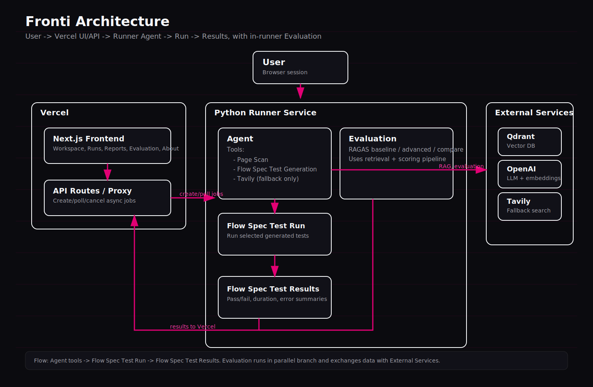
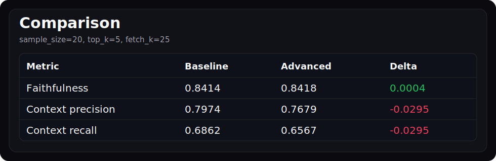

# Fronti-AI QA Copilot - Certification Challenge Writeup

## Repository and Demo
- GitHub repository: `ADD_GITHUB_REPO_LINK`
- Loom demo video (<= 5 minutes): `ADD_LOOM_LINK`

---

## Task 1: Problem and Audience

### 1. One-sentence problem statement
Frontend regressions and broken frontend-backend integrations are often detected too late, causing delayed releases, production incidents, and excessive manual QA effort.

### 2. Why this is a problem for this user
Frontend and QA engineers working on fast-moving web applications need immediate, trustworthy feedback on whether critical user flows still work after changes. Because frontend behavior depends on backend APIs, auth/session state, and timing-sensitive UI interactions, small changes can break core flows without obvious warnings. Teams then discover issues late in the cycle or post-release, leading to emergency fixes, unstable releases, and context switching.

Maintaining E2E coverage manually also does not scale. Test planning, writing, and updates are labor-intensive, tests drift from product behavior, and brittle selectors increase maintenance cost. This creates a persistent gap between documented requirements, implemented functionality, and real tested coverage.

### 3. Users and evaluation questions
Primary users: Frontend Engineers, QA Engineers  
Job function automated: Faster QA validation of frontend flows and regression risk before release.

Evaluation input-output pairs:
1. Input: User submits target URL and clicks Scan  
   Output: App returns discovered routes, pages found, forms detected, auth-wall signal, and scan summary.
2. Input: User clicks Generate Flow Spec after a completed scan  
   Output: App returns structured E2E test suggestions (title, risk, steps, rationale) with citations.
3. Input: User selects generated tests and clicks Run Selected  
   Output: App executes tests in batches and returns run summary (passed/failed/total/duration) with per-test results.
4. Input: User clicks Re-run Failed Only after a mixed run  
   Output: App runs only previously failed tests and returns updated pass/fail outcomes.
5. Input: User opens Runs page after execution  
   Output: App shows historical run jobs with status, timestamps, progress, and details.
6. Input: User opens Reports page after execution  
   Output: App shows report cards and issue breakdown derived from run results, with exportable structured JSON.
7. Input: User clicks Ingest Playwright Docs in Evaluation  
   Output: App ingests Playwright docs into Qdrant and confirms chunk count + status.
8. Input: User runs Baseline / Advanced / Compare evaluation  
   Output: App returns faithfulness, context_precision, context_recall, and comparison deltas with conclusion.

---

## Task 2: Proposed Solution

### 1. Proposed solution (product + UX)
Fronti-AI QA Copilot is a web application that combines (a) automated page scanning, (b) RAG-grounded Flow Spec generation, (c) Playwright test execution, and (d) retrieval evaluation. The user provides a target URL and optional prompt. The system scans same-origin pages, proposes runnable E2E flows, allows selective execution, and returns pass/fail outcomes with error summaries. 

For this project, I will use a tool stack that supports reliable retrieval, controllable agent behavior, and practical QA execution.
LangGraph will orchestrate the agent flow in explicit steps (agent -> tools -> finalize) so tool usage is traceable and deterministic.
OpenAI chat models will generate Flow Spec test suggestions and support evaluation-time scoring, while OpenAI embeddings will map Playwright documentation into semantic vectors. Qdrant Cloud will store those vectors and metadata for grounded retrieval and citations. Playwright will be used both for page scanning and executable E2E checks against target URLs. Tavily will be enabled as fallback-only web search when internal documentation context is insufficient. RAGAS will evaluate retrieval quality across baseline and advanced retrievers using faithfulness, context precision, and context recall. FastAPI with async workers will run long jobs (scan/run/eval), and the user interface will be built in Next.js App Router + TypeScript + shadcn/ui + Tailwind, deployed with Vercel (frontend/API proxy) and a separate runner service.

### 2. Infrastructure diagram and tooling choices
Infrastructure diagram

Tooling choices:
1. LLM(s): OpenAI chat model generates agent outputs for Flow Spec Test suggestions and also supports evaluation-time answer generation and scoring because it provides stable API behavior and reliable instruction following.
2. Agent orchestration framework: LangGraph orchestrates the agent flow as agent to tools to finalize, which keeps state transitions explicit and predictable.
3. Tool(s): The agent uses three tools: scan_site_context to use scan output from the target URL, search_playwright_docs to retrieve relevant context from Qdrant, and search_web_tavily as fallback web search when Playwright docs context is insufficient.
4. Embedding model: OpenAI embeddings are used to keep semantic retrieval consistent across both document ingest and query-time retrieval.
5. Vector Database: Qdrant Cloud stores vectors and metadata such as source and chunk_id to support filtered retrieval and citations.
6. Monitoring tool: This prototype does not include a dedicated monitoring stack, so runtime visibility is handled through job status and progress in the UI.
7. Evaluation framework: RAGAS evaluates retrieval quality using faithfulness, context_precision, and context_recall on synthetic QA-style samples.
8. User interface: The user interface is built with Next.js App Router, TypeScript, shadcn/ui, and Tailwind to provide fast iteration and a clean internal-tool experience.
9. Deployment tool: Deployment is split so Vercel serves the frontend and API proxy, while a separate Python runner service handles long-running scan, test, and evaluation jobs.
10. Other components: Playwright is used for page scan and E2E execution, and FastAPI exposes asynchronous job APIs and worker orchestration.

### 3. Exact RAG and agent components
- RAG components:
  - Corpus: curated Playwright docs in runner/data/playwright-docs/ (markdown from official repo subset).
  - Ingest pipeline: load markdown -> markdown-aware chunking -> embed with OpenAI -> upsert to Qdrant collection.
  - Retrieval API: retrieve_context(query, top_k) returns retrieved chunks (source, text, score) for grounding.
  - Baseline retriever: dense vector similarity search on Qdrant.
  - Advanced retriever: dense + BM25 ensemble retrieval, then contextual compression (EmbeddingsFilter), then Cohere rerank.
  - Evaluation pipeline: synthetic dataset generation + RAGAS scoring for baseline/advanced/compare jobs.
- Agent components:
  - scan_site_context tool: summarizes scan artifacts (pages_found, forms_detected, auth_walls, top_routes).
  - search_playwright_docs` tool: fetches relevant chunks from Qdrant-backed Playwright corpus.
  - search_web_tavily` tool: fallback-only external search for missing/outdated context.
  - agent` node: LLM-with-tools step that decides tool calls and drafts Flow Spec tests.
  - tools` node: executes requested tools and appends tool messages to graph state.
  - finalize node: extracts/normalizes output into FlowSpecResponse with tests and citations.

---

## Task 3: Data and External API
### 1. Default chunking strategy and rationale
Default chunking is markdown-aware chunking with MarkdownTextSplitter, using chunk_size = 1000 and chunk_overlap = 180.
Documents are loaded from runner/data/playwright-docs/**/*.md (excluding README.md), then split by markdown structure so headings and technical sections remain coherent.  
Each chunk gets a stable chunk_id in metadata (derived from source + index + content prefix) to support deduplication, traceability, and citations.
This chunking strategy was chosen because markdown-aware splitting preserves Playwright documentation semantics better than plain character splitting, the 1000/180 configuration provides a practical balance between retrieval precision and context completeness, and chunk overlap reduces boundary loss when definitions or examples continue across adjacent sections.

### 2. Data source, external API, and interaction during usage
Data source:
The data source is a curated subset of official Playwright documentation stored locally in runner/data/playwright-docs/ and indexed into Qdrant.
External APIs:
OpenAI API is used for embeddings, agent generation, and evaluation-time generation and scoring, while Tavily API is used only as fallback web search when internal Playwright-document context is insufficient.
Role in solution:
In the overall solution, Playwright docs are the primary grounded knowledge source for Flow Spec generation and retrieval evaluation, OpenAI provides model inference for generation and evaluation tasks, and Tavily remains a controlled fallback rather than the default retrieval path.
Interaction flow:
1. User provides URL and starts scan.
2. Agent retrieves context from Qdrant-indexed Playwright docs.
3. Agent generates Flow Spec tests from scan context + retrieved docs.
4. Tavily is called only if docs retrieval is weak/insufficient.
5. User runs tests; evaluation jobs reuse the same corpus/retrievers and score with RAGAS.

---

## Task 4: End-to-End Prototype
### 1. End-to-end prototype scope
The end-to-end prototype includes same-origin URL page scan with configurable depth and page limits, Flow Spec generation through an agent with RAG context, selective test execution through runner jobs, and re-run failed only behavior.
It also includes run history in /runs, a report view in /reports generated from run outcomes, JSON export of report payloads, and an evaluation panel with Playwright-doc ingestion, retrieval test action, and baseline/advanced/compare evaluation modes.
Deployment is split across Vercel for frontend and API proxy, a separate Python runner service for long-running jobs such as scan, tests, and evaluation, and Qdrant Cloud as the vector database.

---

## Task 5: Baseline Evaluation with RAGAS
### 1. Baseline evaluation setup and metrics
The synthetic test set is generated from the same Playwright documentation corpus, and the baseline retriever uses dense vector retrieval only.

### 2. Conclusions from baseline
Baseline dense retrieval is a stable semantic baseline for Playwright QA queries and serves as reference point for advanced retriever comparison.

---

## Task 6: Advanced Retriever Upgrade
### 1. Chosen technique and rationale
The advanced technique uses a contextual compression retriever with a BM25 stage followed by Cohere reranking, where dense retrieval captures semantic intent, BM25 improves lexical matching for strict technical terms, and reranking improves the ordering of candidate chunks before final scoring.

### 2. Implementation summary
Advanced retrieval is implemented as a multi-stage pipeline that first combines dense Qdrant similarity results with BM25 lexical results through an ensemble retriever, then applies contextual compression with an embeddings-based filter, deduplicates candidates by chunk identity and source, and finally applies Cohere reranking when available to produce the final ranked context set.

### 3. Performance comparison
Configuration used: sample_size=20, top_k=5, fetch_k=25.

| Metric | Baseline | Advanced | Delta |
|---|---:|---:|---:|
| faithfulness | 0.8414 | 0.8418 | 0.0004 |
| context_precision | 0.7974 | 0.7679 | -0.0295 |
| context_recall | 0.6862 | 0.6567 | -0.0295 |

Short conclusion:
In this run, the advanced retriever did not outperform the baseline.
Faithfulness is slightly higher for advanced by 0.0004, but this difference is negligible in practice.
Context precision is lower by 0.0295, which indicates that advanced retrieval returned less relevant context on average.
Context recall is also lower by 0.0295, which suggests that advanced retrieval captured less of the needed context than baseline.
Overall, with sample_size 20, top_k 5, and fetch_k 25, the extra advanced steps did not improve quality and likely introduced either additional noise or over-filtering.
This does not mean the advanced approach is generally worse, but it does mean it needs further tuning of retrieval weights and parameters before it can consistently beat baseline.

---

## Task 7: Next Steps
1. Optionally add report export as a post-challenge enhancement.
2. Optionally add GitHub repository context ingestion as a post-challenge enhancement.

---
